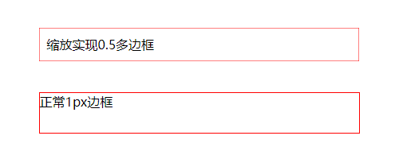

## 目的

0.5宽度边框有必要么，答案是：不是必要的，但是我觉得有两个理由
1. 如果你想让你的UI在多设备上看这效果更一致，更精细，那就看一下
2. 面试会问

下面我们介绍实现0.5宽度边框的各种方法

#### 0.5边框-渐变


```html
<!DOCTYPE html>
<html lang="en">
<head>
  <meta charset="UTF-8">
  <meta http-equiv="X-UA-Compatible" content="IE=edge">
  <meta name="viewport" content="width=device-width, initial-scale=1.0">
  <title>0.5px边框-渐变</title>

  <style>
    .container {
      width: 400px;
      margin: 0px auto;
    }
    .border-box {
      position: relative;
      padding: 10px;
    }
    .border-box::after {
      content: '';
      position: absolute;
      left: 0;
      bottom: 0;
      width: 100%;
      height: 1px;
      background-image: linear-gradient(0deg, red 50%, transparent 50%);
    }
    .normal-border {
      width: 400px;
      height: 50px;
      border-bottom: 1px solid red;
    }
  </style>
</head>
<body>
  
  <div class="container">
    <div class="border-box">
      渐变实现0.5单边框
    </div>

    <div class="normal-border">
      正常1px边框
    </div>
  </div>

</body>
</html>
```

## 0.5边框-缩放-单边框


```html
<!DOCTYPE html>
<html lang="en">
<head>
  <meta charset="UTF-8">
  <meta http-equiv="X-UA-Compatible" content="IE=edge">
  <meta name="viewport" content="width=device-width, initial-scale=1.0">
  <title>0.5px边框-单边框</title>

  <style>
    .container {
      width: 400px;
      margin: 0px auto;
    }
    .border-box {
      position: relative;
      padding: 10px;
    }
    .border-box::after {
      content: '';
      position: absolute;
      left: 0;
      bottom: 0;
      width: 100%;
      height: 1px;
      background-color: red;
      transform: scaleY(0.5);
    }
    .normal-border {
      width: 400px;
      height: 50px;
      border-bottom: 1px solid red;
    }
  </style>
</head>
<body>
  
  <div class="container">
    <div class="border-box">
      缩放实现0.5单边框
    </div>

    <div class="normal-border">
      正常1px边框
    </div>
  </div>

</body>
</html>
```

#### 0.5边框-缩放-多边框



```html
<!DOCTYPE html>
<html lang="en">
<head>
  <meta charset="UTF-8">
  <meta http-equiv="X-UA-Compatible" content="IE=edge">
  <meta name="viewport" content="width=device-width, initial-scale=1.0">
  <title>0.5px边框-多边框</title>

  <style>
    .container {
      width: 500px;
      margin: 0px auto;
    }
    .border-box {
      position: relative;
      padding: 10px;
    }
    .border-box::after {
      content: '';
      position: absolute;
      top: 0;
      left: 0;
      width: 200%;
      height: 200%;
      border: 1px solid red;
      transform: scale(.5, .5);
      /* 基于哪个坐标点进行缩放，这里是左上角 */
      transform-origin: 0 0;
    }
    .normal-border {
      margin-top: 40px;
      width: 400px;
      height: 50px;
      border: 1px solid red;
    }
  </style>
</head>
<body>
  
  <div class="container">
    <div class="border-box">
      缩放实现0.5多边框
    </div>

    <div class="normal-border">
      正常1px边框
    </div>
  </div>

</body>
</html>
```