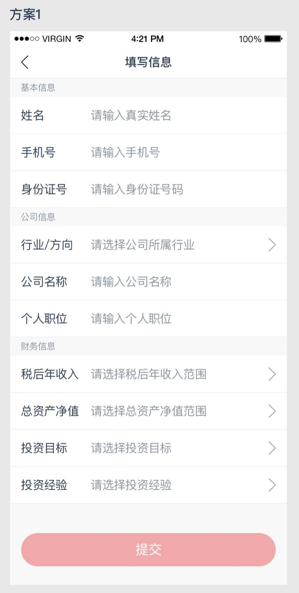
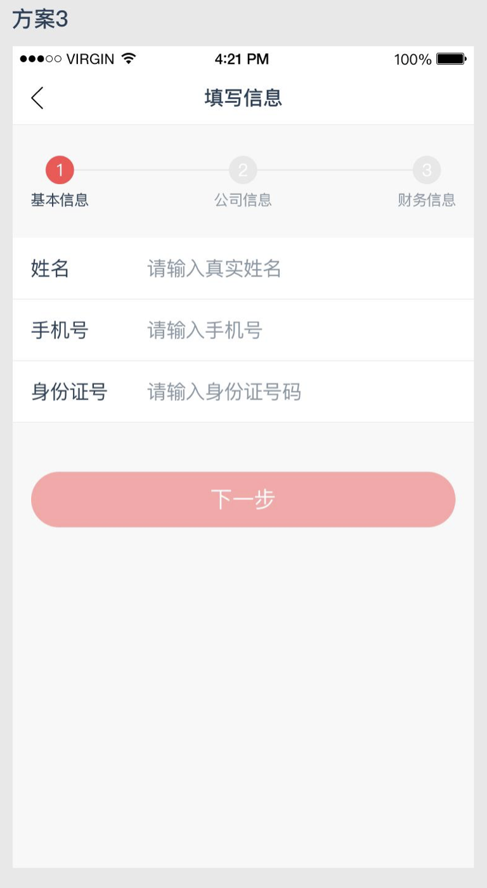

## 产品设计之表单优化

作为产品，遇到很复杂的表单的时候一般都会想着分步骤让用户进行填写，特别是移动端更是如此，请看下图





图一给用户的第一感觉就是，我去，需要填写这么多东西啊，不填了（就和男女朋友第一次见面一样，首次印象很重要，首次印象不好，就别想有下次了），业务也是一样的，不能一上来就把用户吓跑了，所以图二就是很好的设计，这就是表单设计的柯里化思想

## 函数式开发中的柯里化

举一个很经典的例子（ 计算器 ）

```js
function sum() {
    var sum = 0
    return function(a) {
        return sum += a
    }
}

var add = sum()

add(1) // 1
add(2) // 3
add(3) // 6
add(4) // 10

```

看到这里理解函数的柯里化了么

## 函数柯里化的定义

> 维基百科上说道：柯里化，英语：Currying(果然是满满的英译中的既视感)，是把接受多个参数的函数变换成接受一个单一参数（最初函数的第一个参数）的函数，并且返回接受余下的参数而且返回结果的新函数的技术。

那么看到这里跟vue有什么关系呢，跟性能优化有什么关系呢

## vue 函数柯里化思想

举个例子吧，模板中经常会出现。a.b.c 这种数据绑定关系，通过如下函数可以获得对象的 c 的属性值

```js
// 没有柯里化, 性能消耗的地方是，每次渲染都需要split path 
function getPropByPath(obj, path) {
    var props = path.split('.')
    var prop;
    var retValue = obj;
    while(prop = props.shift()){
        retValue = retValue[prop]
    }

    return retValue
}

// 柯里化， 在变异阶段进行一次 split path ，之后调用仅仅做属性的获取
function createGetPropByPath(path) {
    var props = path.split('.')

    return function(obj) {
        var prop;
        var retValue = obj;
        while(prop = props.shift()){
           retValue = retValue[prop]
        }

        return retValue
    }
}
```

## vue中函数柯里化应用 markMap

```js
    // 判断元素
    function markMap(htmlStr) {
        let set = {}
        htmlStr.split(',').forEach( tag => set[key] = true )
        return function(tagName) {
            return  !!set[tagName.toLowerCase()]
        }        
    }

    const isHtmlTag = markMap(`
        div,a,span,header,section,footer,h1,h2,h3,h4
    `) // 等等

    isHtmlTag('div') // true
    usHtmlTag('List') // false

    // 在编译时期就会得到isHtmlTag函数，避免运行时大量的组建判断造成的性能损失
```

总结：这仅仅是函数柯里化的部分应用实践，函数柯里化因为函数时编程必然出现的一个特征，用途很广泛，不仅仅是用在性能优化上，还能优化代码结构，层级，调用方式等等